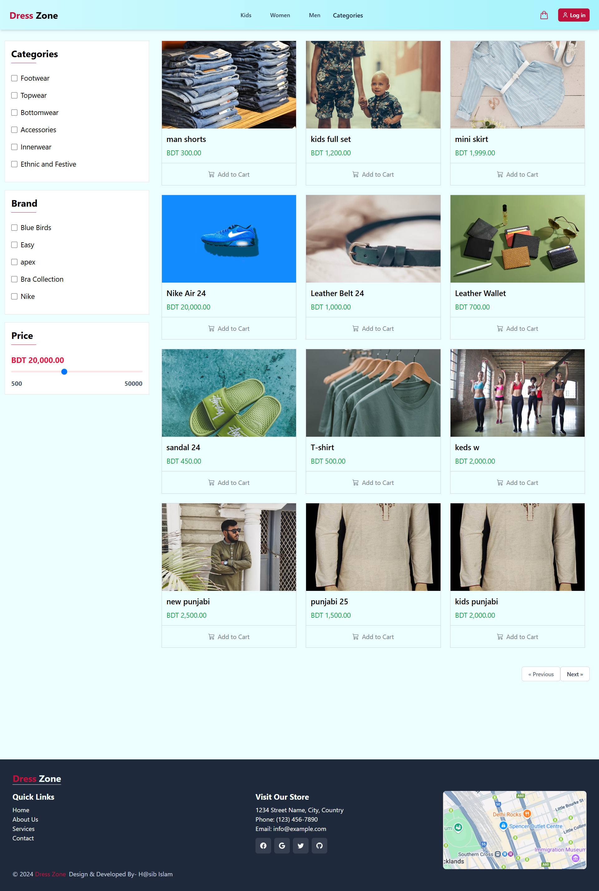
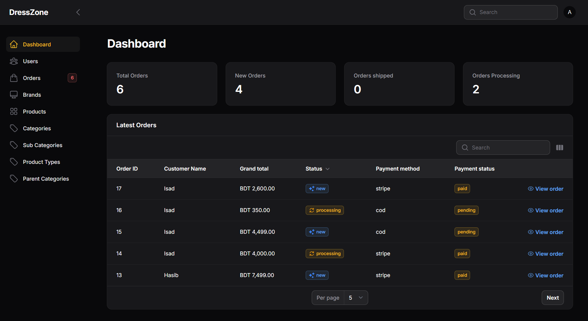

# Dress Zone - E-commerce Website

Dress Zone is a modern e-commerce website built with [Laravel](https://laravel.com/), [Tailwind CSS](https://tailwindcss.com/), [MySQL](https://www.mysql.com/), and [Livewire](https://livewire.laravel.com/). The admin dashboard is powered by [Filament](https://filamentphp.com/).

## Features

-   User authentication (register, login, logout)
-   Product catalog with categories and brands
-   Shopping cart management
-   Checkout process with multiple payment methods
-   Order placement and order history
-   Admin dashboard for product, order, and user management (Filament)
-   Responsive design with Tailwind CSS
-   Real-time UI updates with Livewire

## Tech Stack

-   **Backend:** Laravel, MySQL
-   **Frontend:** Tailwind CSS, Blade, Livewire
-   **Admin Panel:** Filament

## Getting Started

1. Clone the repository:

    ```sh
    git clone https://github.com/hasiboctane/ecommerce_two
    cd project_folder
    ```

2. Install dependencies:

    ```sh
    composer install
    npm install
    ```

3. Copy `.env.example` to `.env` and set your environment variables.

4. Run migrations:

    ```sh
    php artisan migrate
    ```

5. Build frontend assets:

    ```sh
    npm run build
    ```

6. Start the development server:
   `sh
php artisan serve
`
   
   

## License

The website is licensed under the [Dress Zone License](https://dresszone.fashion).
